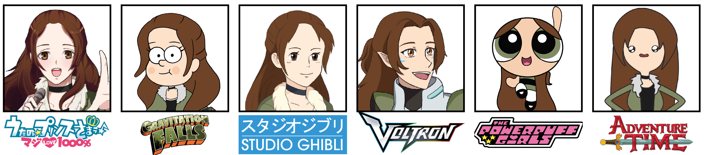
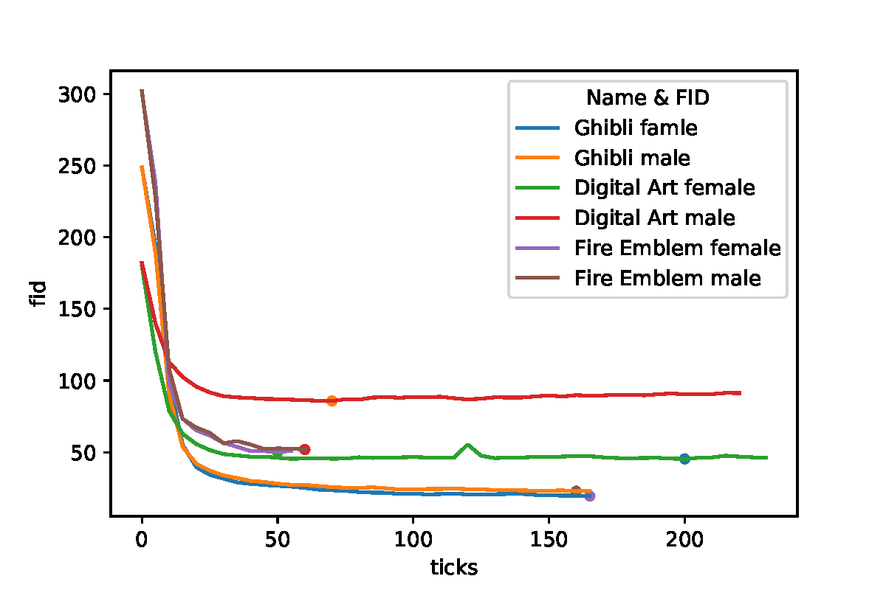
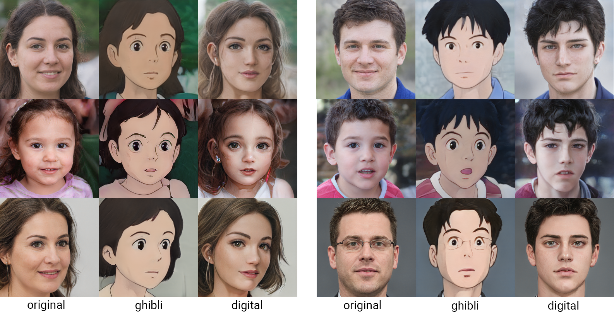

<p align="center">
  
  <h3 align="center">Art Style Challenge</h3>

  <p align="center">
    194.077 – Applied Deep Learning
  </p>
</p>


## Table of contents

- [Idea Description](#idea-description)
- [State of the Art](#state-of-the-art)
- [Methodology](#methodology)
- [Timeline](#timeline)
- [References](#references)

## Idea Description

**Topic:**
Creating art requires skill and tools and can be time-consuming.
Coming from a graphic design background, I was eager to use deep learning approaches to substitute conventional illustration methods. 
In previous work, I experimented with StyleGANs to generate characters from the *Animal Crossing* franchise. 
For this project, I aim to participate in the famous online drawing challenge: *Art Style Challenge*.
It was invented around six years ago by a 17-year-old Instagrammer called *beautifulness87*. 
The goal was to redraw the same character in as many art styles as possible, including famous shows like *Adventure Time*, *Steven Universe*, *Gravity Falls*, or even studio styles like *Disney* or *Ghibli*. 
The options are almost limitless.
The header of this README shows my take on the Art Style Challenge from 4 years ago.

However, instead of drawing them by hand, which requires multiple hours and drawing skills, we utilize StyleGANs.
Gathering our data, we either train our model using transfer learning or train a new conditional GAN from scratch. 
We further apply style transfer by mixing the weights of StyleGANs within different domains [[2]](#2).
We aim to generate deceptively real-looking characters in a minimum of about five different styles. 

**Type:**
Bring your own data 

## State of the Art

The use of StyleGANs is a currently explored research topic and can be deployed in various applications in the field of image generation. 
For our study, we further explore style transfer utilizing StyleGANs.
State-of-the-art approaches show promising results for gaining more control over a style on different levels of detail.


- **Higher control over the outcome:** 
Pinkney et al. [[2]](#2) proposed a method for controllable image synthesis by fine-tuning the interpolation of different resolution layers in the model. 
Each layer responds to different features.
While the lower levels address the shape and geometry of the face, higher-resolution layers are responsible for the texture, color, and lighting. 
Based on StyleGAN2 the method starts with a pre-trained model and uses transfer learning for the new dataset. 
Instead of linearly interpolating between all the parameters, an arbitrary function is used to mix the weights from the original and new generators.
The examples chose a binary decision between either turning a new layer on or off, called "layer swapping". 
Swapping the layer can enable the preservation of the face shape and only apply texture and color of the new style, enabling more control over the outcome.
- **Less data:**
Training a generative adversarial network often requires a vast amount of data.
Therefore, finding and retrieving the images of a specific art style poses one of the main challenges. 
Available samples of a certain quality are limited and time-consuming to collect. 
However, using too little data often leads to overfitting and unsatisfactory results. 
Using the standard solution of data augmentation might lead to unwanted artifacts, especially when trying to copy a style. 
Karras et al. [[5]](#5) introduce a variation called adaptive discriminator augmentation (ADA), which significantly stabilizes training with limited data.
Additional test show that transfer learning also benefits from ADA, which further reduces the training data requirements. 
- **Closer resemblance:** 
For the last improvement, we aim for a higher resemblance between the stylized image and the original person. 
Song et al. [[3]](#3) achieve good generalization of different portrait styles using inversion-consistent transfer learning.
Furthermore, it efficiently encodes different levels of details by augmenting a multi-resolution latent space.
To better match the original appearance, an attribute-aware generator is introduced. Artists often apply different stylizations depending on gender, age, and other attributes. 
AgileGANs multi-path generator considers this theory and further enhances features based on different attributes. 

## Methodology
### State-of-the-art
First, we set up the state-of-the-art papers and their corresponding repositories as listed in the following Table.

|                             Repository                            |                  Description                 |               Paper              |
|:-----------------------------------------------------------------:|:--------------------------------------------:|:--------------------------------:|
|   <a href="https://github.com/NVlabs/stylegan2-ada-pytorch">StyleGAN2</a> | official pytorch implementation of StyleGAN2 | [[4]](#4) |
|       <a href="https://github.com/NVlabs/stylegan3">StyleGAN3</a>      |         official pytorch implementation of StyleGAN3         |  [[1]](#1)  |

We aim to compare the results of our Style Challenge generated by StyleGAN2 and StyleGAN3.

### Datasets
Search for suitable datasets of images and faces that define domains similar to the FFHQ dataset.
We aim to semi-automize our collecting process by introducing image scrappers or applying face recognition on videos and extracting the faces.
Last we preprocess our data by aligning and cropping the images and using the repository's tools to generate a matching database for our models.

For now, we gathered the following datasets:
|      Art Style   |  #all | #male |  #female  |
|:----------------:|:----------------:|:---------:|:----------:|
|   Studio Ghibli  |        4,207        |     1,549    | 2,658 |
|  Fire Emblem |        398       |     183   | 215 |
|     Digital Art    |        346       |     100    | 246 |

The following list highlights the main steps carried out for the data collection process.  

1. **Studio Ghilbli**: <br>
Step 1: collect video data from all the movies (use your own movie collection) <br>
Step 2: Extract the faces using `anime_extractor.py` (which uses the <a href="https://pypi.org/project/anime-face-detector/">anime-face-detector</a> [[6]](#6) to find the faces) <br>
Step 3: Manually clean up the dataset (remove non-humans and side profiles) <br>
Step 4: divide the data into male and female characters <br>

2. **Fire Emblem**: <br>
Step 1: Collect original character Sprites from *Fire Emblem Three Houses* and *Fire Emblem Fates* games <br>
Step 2: Use Photoshop Batch Processing since all sprites are based on the same layout <br>

3. **Digital Art**: <br>
Step 1: Collect digital art paintings from sakimichan <br>
Step 2: Gather additional data by either handpicking or scrapping images from pinterest <br>
Step 3: Crop and extract faces <br>

### Training
We train multiple models utilizing transfer learning and evaluate their progress using the Frichet Inception Distance (FID) during the training process.
Additionally, we train a conditional StyleGAN, including all selected art styles. 

We trained the following models:
|      Targer Data   |  Base Model | Training Time |   FID Estimation  |   FID  |
|:------------------:|:-----------:|:-------------:|:-----------------:|:------:|
| Studio Ghibli male |   ffhq-256  | 23h 02m 32s   | 30 | 22.82 |
|Studio Ghibli female|   ffhq-256  | 22h 39m 30s   | 30 | 19.52 |
|    Fire Emblem male|   ffhq-512  | 23h 50m 31s   | 50 | 51.93 |
| Fire Emblem female |   ffhq-512  | 21h 24m 19s   | 50 | 50.18 |
|   Digital Art male |   ffhq-256  | 11h 40m 20s   | 50 | 85.78 |
| Digital Art female |   ffhq-256  | 11h 59m 11s   | 50 | 45.39 |

<p align="center">
  
</p>

The FID estimation was based on the number of images we collected for our database. 
However, when comparing both Digital Art models, the female model reaches a significantly lower FID with approximately the doubled amount of data.

### Build Application
We build a small web application. 
Depending on the remaining time, we will either show all the trained styles on randomly generated people or add an encoder model such that a user can upload an image of a face and apply the styles to real data.

## Prototype

Due to a lack of hardware, the whole project was set up and tested using Google Colab and Google Drive. 
The prototype is placed in the demo folder and comes from the jupyter notebooks. 
Follow the installation and usage guides below to test the project and reproduce the findings.

### Installation
For the setup in Google Colab all imports and installation comands are already provided. <br>

You can also set up this repo locally (not recommended) since I performed the entire training process on Google Colab because of the lack of suitable hardware.
We tested this setup on Ubuntu 20.04 with CUDA 11.1, python 3.8, and PyTorch 1.8.

After setting up the correct python, cuda, cudnn, nvcc and gcc version use:

```
python3 -m venv .venv
source .venv/bin/activate
pip install -r requirements.txt -f https://download.pytorch.org/whl/torch_stable.html
```
in order to install the requirements needed for the StyleGAN training and evaluation.

Additionally, install these packages manually for `extract_faces.ipynb`:<br>
to use `anime_extractor.py` the <a href="https://pypi.org/project/anime-face-detector/">anime-face-detector</a> is needed. Install:
```
pip install openmim
mim install mmcv-full
mim install mmdet
mim install mmpose

pip install anime-face-detector
```
`realistic_extractor.py` uses <a href="https://github.com/ageitgey/face_recognition">face_recognition</a>, for that install:

```
pip3 install face_recognition
```
Again, this is only needed for the face extraction tool to build your own dataset. 

### Usage
- `generate_styles.ipynb`: presents and generates results of the trained StyleGANs models. To test, upload the pretrained models and base model on drive and adjust the source paths. Set parameters as described in the notebook and generate images.
- `evaluate_model.ipynb`: is used to evaluate the models' performance and visualize the training process. The result are located in the images folder.
- Again, upload the models and adjust the paths.
- `extract_faces.ipynb`: semi-automates the dataset-building process. Faces can be cropped from videos or image folders using either a face detector for realistic styles or cartoony styles. 
- `app.ipynb`: starts a webapplication to perform style transfer on custom faces or random faces. Make sure to use a squared image that is cropped properly! (models are downloaded automatically, for examples images to upload into the application see the example_target folder)

### Results
Styles produced by `generate_styles.ipynb` (more to come):
<p align="center">
  
</p>
note: unfortunatly, I trained the fire emblem models in different resolutions. Examples will follow later.

Visualization of training process (`evaluate_model.ipynb`)


https://user-images.githubusercontent.com/61754345/207718872-67d86103-1bda-4b99-a683-373f4202621d.mov

https://user-images.githubusercontent.com/61754345/207719510-9d9e1891-a844-4d31-af60-10ae2c6131eb.mov

https://user-images.githubusercontent.com/61754345/207719348-068a212b-fb04-4852-ab52-9114219fdd7a.mov

https://user-images.githubusercontent.com/61754345/207719392-e9860738-ab28-4cd1-82b5-a504b7325589.mov

## Timeline

|      Milestone   |  Time Estimation | Real Time |  Deadline  |
|:----------------:|:----------------:|:---------:|:----------:|
|   Project Set-Up |        4h        |     8h    | 14.12.2022 |
|  Data Collection |        10h       |     15h   | 14.12.2022 |
|     Prototype    |        12h       |     15h   | 14.12.2022 |
| Final Implementation |    18h       |     10h     | 18.01.2023 |
|      Report      |        10h       |     6h     | 18.01.2023 |
| Final Presentation |      4h        |     4h     | 26.01.2023 |

## References

<a id="1">[1]</a> 
Tero Karras, Miika Aittala, Samuli Laine, Erik Härkönen, Janne Hellsten, Jaakko
Lehtinen, and Timo Aila. Alias-free generative adversarial networks. *Advances in
Neural Information Processing Systems*, 34, 2021.

<a id="2">[2]</a> 
Justin NM Pinkney and Doron Adler. Resolution dependent gan interpolation for
controllable image synthesis between domains. *Machine Learning for Creativity and
Design NeurIPS 2020 Workshop*, 2020.

<a id="3">[3]</a> 
Guoxian Song, Linjie Luo, Jing Liu, Wan-Chun Ma, Chunpong Lai, Chuanxia Zheng,
and Tat-Jen Cham. Agilegan: stylizing portraits by inversion-consistent transfer
learning. *ACM Transactions on Graphics (TOG)*, 40(4):1–13, 2021.

<a id="4">[4]</a> 
Yuri Viazovetskyi, Vladimir Ivashkin, and Evgeny Kashin. Stylegan2 distillation
for feed-forward image manipulation. *In European Conference on Computer Vision,
pages 170–186. Springer*, 2020.

<a id="5">[5]</a> 
Tero Karras, Miika Aittala, Janne Hellsten, Samuli Laine, Jaakko Lehtinen, and Timo Aila.
Training generative adversarial networks with limited data. Advances in Neural Information
Processing Systems, 33:12104–12114, 2020.

<a id="6">[6]</a> 
hysts. Anime face detector. https://github.com/hysts/anime-face-detector, 2021.
